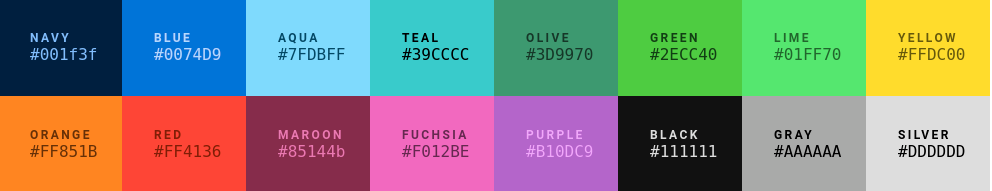

# webclrs
A nicer color palette for the web in Python. (https://clrs.cc/)

## Installation

```shell
$ pip install webclrs
```

## Usage

```python
>>> import webclrs
>>> webclrs.NAVY
'#001f3f'
```

## Available colors
<a href="https://clrs.cc/">
